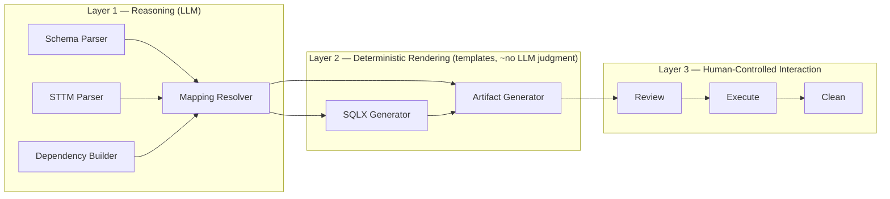
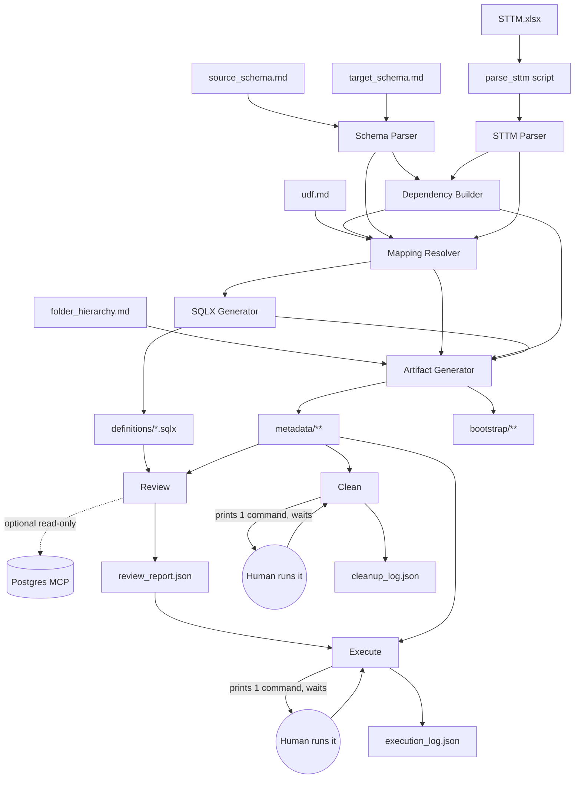

# SQLX ETL Generator Skill — Architecture Specification & ADR-001

Status: **Proposed** (ready for `/run-skill-generator`)
Domain under test: Pharma–Hospital · Scope: `DIM_PATIENT`, `FACT_PATIENT_VISIT` · Target: PostgreSQL

---

## 1. Architecture Overview & Core Principles

The design rests on one separation that everything else follows from: **reasoning is expensive and non-deterministic; rendering and execution should not be.**

Three layers, strictly one-directional:



**Principles, in priority order:**

1. **Reasoning happens once, in one place.** Only Layer 1 specialists (specifically the Mapping Resolver) make semantic judgment calls. Every downstream consumer treats their output as a frozen contract.
2. **Rendering is templating, not generation.** The SQLX Generator and Artifact Generator never re-derive meaning from source docs — they fill templates from a structured intermediate representation (IR). This is what keeps token cost flat as table count grows and output byte-for-byte reproducible for identical inputs.
3. **Generate is total and idempotent.** Every `Generate` run fully regenerates `definitions/` and `metadata/` from the five declared inputs. No incremental patching, no silent merging with prior output. Same inputs → same output.
4. **Human hands stay on the keyboard for anything that touches a database.** `Execute` and `Clean` never run SQL themselves. This is not a limitation to work around later — it's the safety boundary that makes the whole system trustworthy enough to eventually automate (see §11).
5. **Metadata is the API between plans.** `Review`, `Execute`, and `Clean` never re-read the five source documents. They only ever read what `Generate` (or their own prior run) wrote to `metadata/`. This is what makes them "dumb" by construction, not by discipline.

---

## 2. Specialist Responsibilities (Generate's internals)

Six specialists, run in strict sequence by `Generate`. One rename from the original proposal: **`Definitions Generator` → `Mapping Resolver`** — the original name collided with the generated project's `definitions/` output folder, which is actually populated by the SQLX Generator, not this specialist. The new name states what it actually produces: the resolved build-spec IR.

| # | Specialist | Input | Output | Nature |
|---|---|---|---|---|
| 1 | **Schema Parser** | `source_schema.md`, `target_schema.md` | `metadata/schema/source_schema.json`, `metadata/schema/target_schema.json` | LLM parse (low ambiguity — already-structured markdown) |
| 2 | **STTM Parser** | STTM `.xlsx` | `metadata/mapping/sttm.json` | **Deterministic script first** (see below), LLM only over the normalized output |
| 3 | **Dependency Builder** | both schema JSONs, `sttm.json` | `metadata/dependency/dependency_graph.json` | LLM-assisted graph construction, deterministic cycle check |
| 4 | **Mapping Resolver** | schema JSONs, `sttm.json`, `dependency_graph.json`, `udf.md` | `metadata/build/<TABLE>.buildspec.json` (one per target table) | LLM — **the only specialist that makes semantic judgment calls** |
| 5 | **SQLX Generator** | `<TABLE>.buildspec.json` only | `definitions/<TABLE>/{read,process,write}.sqlx` | Pure deterministic templating — no source-doc access |
| 6 | **Artifact Generator** | everything above | `metadata/execution/execution_plan.json`, `metadata/review/review_spec.json`, `metadata/cleanup/cleanup_manifest.json`, `bootstrap/**`, `metadata/manifest.json` | Deterministic templating; runs last so it can hash final files |

Design notes:

- **STTM Parser owns a shipped script** (`scripts/parse_sttm.*`) that flattens the workbook into normalized JSON/CSV *before* any LLM reasoning touches it. Spreadsheets are the least structurally reliable of the five inputs (merged cells, inconsistent headers, free-text notes) — having Claude "eyeball" raw cell grids is the single biggest threat to determinism and token budget in this whole system. The script enforces a strict expected-column-header contract and **fails loudly** on mismatch rather than guessing a layout.
- **Dependency Builder must fail Generate outright on a cycle** — no partial output, no best-effort ordering. A DAG with a cycle means the STTM or schema docs are wrong; that's a data problem to surface, not a scheduling problem to paper over.
- **Mapping Resolver is the only place ambiguity is allowed to surface**, and even there it must not silently guess: any mapping it cannot confidently resolve gets written into the buildspec with `transformation: "NEEDS_REVIEW"` rather than a best-guess expression. `Review` treats any `NEEDS_REVIEW` entry as a hard failure.
- **SQLX Generator takes no input except the buildspec.** If a buildspec is missing a field the template needs, this specialist fails — it must never fall back to re-reading `sttm.json` or inferring intent. This is the load-bearing constraint for "low token usage": rendering N tables costs the same per table regardless of source-doc complexity.

---

## 3. Skill Package Folder Structure

This is the structure of the **skill itself** (what `/run-skill-generator` will produce):

```
sqlx-etl-generator/
  SKILL.md                          # entry point — describes the 4 user-facing plans only
  plans/
    generate.md
    review.md
    execute.md
    clean.md
  specialists/                      # invoked only from within generate.md
    schema-parser.md
    sttm-parser.md
    dependency-builder.md
    mapping-resolver.md
    sqlx-generator.md
    artifact-generator.md
  scripts/
    parse_sttm.py                   # deterministic Excel → JSON preprocessor (STTM Parser)
  templates/
    sqlx/
      read.sqlx.tmpl
      process.sqlx.tmpl
      write.sqlx.tmpl
    bootstrap/
      ddl.sql.tmpl
      reset.sql.tmpl
      seed_stub.sql.tmpl
  schemas/                          # JSON Schema for every metadata artifact — used by Review
    source_schema.schema.json
    target_schema.schema.json
    sttm.schema.json
    dependency_graph.schema.json
    buildspec.schema.json
    execution_plan.schema.json
    execution_log.schema.json
    review_spec.schema.json
    review_report.schema.json
    cleanup_manifest.schema.json
    cleanup_log.schema.json
    manifest.schema.json
    bootstrap_manifest.schema.json
  references/
    sqlx-syntax-guide.md
    naming-conventions.md
```

Rationale: specialists are separate files, not inlined into `generate.md`, so each loads into context only when its stage runs — this is the mechanism behind "low Claude token usage," not just a code-organization preference. `schemas/` is shipped so `Review` validates against real JSON Schema rather than ad hoc rules, per your instruction that Review must validate against generated specifications, not invent them.

---

## 4. Generated Project Structure

This is the structure `Generate` produces as its **output repository**:

```
<project_name>/
  definitions/
    DIM_PATIENT/
      read.sqlx
      process.sqlx
      write.sqlx
    FACT_PATIENT_VISIT/
      read.sqlx
      process.sqlx
      write.sqlx
  metadata/
    manifest.json                          # Generate-owned
    schema/
      source_schema.json                   # Generate-owned
      target_schema.json                   # Generate-owned
    mapping/
      sttm.json                            # Generate-owned
    dependency/
      dependency_graph.json                # Generate-owned
    build/
      DIM_PATIENT.buildspec.json           # Generate-owned
      FACT_PATIENT_VISIT.buildspec.json    # Generate-owned
    execution/
      execution_plan.json                  # Generate-owned
      execution_log.json                   # Execute-owned, append-only
    review/
      review_spec.json                     # Generate-owned (the rules)
      review_report.json                   # Review-owned (the results)
    cleanup/
      cleanup_manifest.json                # Generate-owned
      cleanup_log.json                     # Clean-owned, append-only
  bootstrap/
    README.md
    db/
      01_init/create_schemas.sql
      02_source/ddl_source_tables.sql
      02_source/seed_source_data.sql       # stub — see §5 and §9
      03_intermediate/init_staging_schema.sql
      04_target/ddl_target_tables.sql
    reset/
      reset_source.sql
      reset_intermediate.sql
      reset_target.sql
    manifest.json                          # bootstrap's own object inventory
```

**Ownership legend** (governs write access — enforced by convention, not tooling): a file is written by exactly one plan. Every other plan only reads it. This is what makes it possible to reason about any single plan's behavior without reading the others.

| Plan | Reads | Writes |
|---|---|---|
| Generate | 5 source docs | everything except `review_report.json`, `execution_log.json`, `cleanup_log.json` |
| Review | `definitions/**`, `metadata/build/**`, `review_spec.json`, `manifest.json` (hashes); optionally live DB schema via MCP (read-only) | `review_report.json` |
| Execute | `execution_plan.json`, `review_report.json` (gate check) | appends to `execution_log.json` |
| Clean | `cleanup_manifest.json` | appends to `cleanup_log.json` |

---

## 5. Bootstrap Design

Bootstrap is **not a fifth plan** — it's static, generated content that ships inside the output repository for a human to run manually, following the exact same "human hands on the keyboard" philosophy as `Execute`. `Generate`'s Artifact Generator produces it as one more deterministic rendering target (schema-IR-driven), not via a new specialist — there's no strong architectural reason to add one.

```
bootstrap/
  README.md                              # manual run order + psql/MCP invocation examples
  db/
    01_init/
      create_schemas.sql                 # CREATE SCHEMA IF NOT EXISTS, per DB
    02_source/
      ddl_source_tables.sql              # from source_schema.json — deterministic
      seed_source_data.sql               # STUB — see below, not fabricated
    03_intermediate/
      init_staging_schema.sql            # empty namespace prep; staging tables themselves
                                          # are created at runtime by process.sqlx, not bootstrap
    04_target/
      ddl_target_tables.sql              # from target_schema.json — deterministic
  reset/
    reset_source.sql                     # DROP/TRUNCATE per table in source_schema.json
    reset_intermediate.sql
    reset_target.sql
  manifest.json
```

**Open gap, resolved:** none of the five declared inputs contain sample data. DDL generation is safe (it's a deterministic projection of the schema IR), but *seed row values* are not derivable from any input — fabricating plausible-looking pharma/patient data would mean the LLM is inventing data no document asked for, which fights the "deterministic behavior" goal and is a bad habit for a skill that may later touch real domains. Resolution: `seed_source_data.sql` is emitted as a **stub** — correct `INSERT INTO … (columns)` scaffolding derived from the schema IR, with `-- TODO: populate sample rows` markers and zero fabricated values. If sample data becomes a real requirement, add it as a declared sixth input type in a future revision (see §11) rather than having a specialist invent it.

`bootstrap/manifest.json` mirrors `cleanup_manifest.json`'s shape (object inventory with commands) but is a separate file with a separate lifecycle: bootstrap objects are demo/test environment scaffolding, created once and rarely torn down; cleanup objects are pipeline run artifacts, torn down per `Clean` invocation. Conflating them would make `Clean` accidentally capable of dropping the demo environment, not just the pipeline's output.

---

## 6–7. Metadata Artifacts & Schemas

### Artifact inventory

| Path | Producer | Consumer(s) | Regenerated |
|---|---|---|---|
| `metadata/schema/source_schema.json` | Schema Parser | Mapping Resolver, Dependency Builder | every Generate |
| `metadata/schema/target_schema.json` | Schema Parser | Mapping Resolver, Dependency Builder, Review | every Generate |
| `metadata/mapping/sttm.json` | STTM Parser | Dependency Builder, Mapping Resolver | every Generate |
| `metadata/dependency/dependency_graph.json` | Dependency Builder | Mapping Resolver, Artifact Generator (execution_plan) | every Generate |
| `metadata/build/<TABLE>.buildspec.json` | Mapping Resolver | SQLX Generator, Artifact Generator (review_spec, cleanup_manifest) | every Generate |
| `metadata/execution/execution_plan.json` | Artifact Generator | Execute | every Generate |
| `metadata/execution/execution_log.json` | Execute | (audit trail; future automation) | appended by Execute |
| `metadata/review/review_spec.json` | Artifact Generator | Review | every Generate |
| `metadata/review/review_report.json` | Review | Execute (gate check) | every Review run |
| `metadata/cleanup/cleanup_manifest.json` | Artifact Generator | Clean | every Generate |
| `metadata/cleanup/cleanup_log.json` | Clean | (audit trail) | appended by Clean |
| `metadata/manifest.json` | Artifact Generator | Review (drift/hash check) | every Generate |
| `bootstrap/manifest.json` | Artifact Generator | (human reference) | every Generate |

### Schemas (field-level)

**`schema/{source,target}_schema.json`**
```json
{
  "database": "source_db",
  "generated_at": "ISO8601",
  "tables": [
    {
      "name": "PATIENT",
      "description": "string",
      "columns": [
        { "name": "patient_id", "type": "integer", "nullable": false,
          "primary_key": true, "foreign_key": null, "description": "string" }
      ]
    }
  ]
}
```

**`mapping/sttm.json`**
```json
{
  "generated_at": "ISO8601",
  "mappings": [
    {
      "id": "M001",
      "target_table": "DIM_PATIENT",
      "target_column": "patient_key",
      "source_table": "PATIENT",
      "source_column": "patient_id",
      "transformation": "DIRECT | EXPRESSION | UDF | CONSTANT | LOOKUP | NEEDS_REVIEW",
      "transformation_detail": "verbatim STTM note, preserved for audit",
      "udf_reference": "string|null",
      "notes": "string|null"
    }
  ]
}
```

**`dependency/dependency_graph.json`**
```json
{
  "generated_at": "ISO8601",
  "nodes": [{ "id": "DIM_PATIENT.read", "table": "DIM_PATIENT", "stage": "read" }],
  "edges": [{ "from": "DIM_PATIENT.write", "to": "FACT_PATIENT_VISIT.process",
              "reason": "FK lookup: patient_key" }],
  "execution_order": [
    "DIM_PATIENT.read", "DIM_PATIENT.process", "DIM_PATIENT.write",
    "FACT_PATIENT_VISIT.read", "FACT_PATIENT_VISIT.process", "FACT_PATIENT_VISIT.write"
  ]
}
```

**`build/<TABLE>.buildspec.json`** — the central IR contract
```json
{
  "target_table": "DIM_PATIENT",
  "target_database": "target_db",
  "load_strategy": "full_load",
  "source_tables": [{ "database": "source_db", "table": "PATIENT" }],
  "staging_table": "stg_dim_patient",
  "columns": [
    { "target_column": "patient_key", "type": "integer",
      "source": { "table": "PATIENT", "column": "patient_id" },
      "transformation": "DIRECT", "expression": null, "udf": null },
    { "target_column": "full_name", "type": "varchar",
      "source": { "table": "PATIENT", "column": ["first_name", "last_name"] },
      "transformation": "UDF", "expression": null, "udf": "fn_concat_name" }
  ],
  "joins": [],
  "filters": [],
  "grain": "one row per patient",
  "mapping_refs": ["M001", "M002"]
}
```
`load_strategy` is an enum reserved now (`full_load` today; `incremental`, `scd2` reserved for future use per §11) so adding incremental loads later is a new enum value and a new template, not a breaking schema migration.

**`execution/execution_plan.json`**
```json
{
  "generated_at": "ISO8601",
  "steps": [
    { "step_id": "1", "table": "DIM_PATIENT", "stage": "read",
      "file": "definitions/DIM_PATIENT/read.sqlx",
      "command": "<single command string>", "depends_on": [] }
  ]
}
```

**`execution/execution_log.json`** (append-only)
```json
{ "entries": [
  { "step_id": "1", "confirmed_at": "ISO8601", "confirmed_by": "user", "status": "confirmed" }
] }
```

**`review/review_spec.json`** (rules — Generate-owned)
```json
{
  "generated_at": "ISO8601",
  "checks": [
    { "id": "C1", "type": "file_exists", "target": "definitions/DIM_PATIENT/read.sqlx" },
    { "id": "C2", "type": "column_coverage", "target_table": "DIM_PATIENT",
      "expected_columns": ["patient_key", "full_name"] },
    { "id": "C3", "type": "udf_reference_valid", "udf": "fn_concat_name" },
    { "id": "C4", "type": "dependency_order_respected" },
    { "id": "C5", "type": "no_needs_review_mappings" },
    { "id": "C6", "type": "schema_cross_check", "scope": "source_db", "optional": true }
  ]
}
```

**`review/review_report.json`** (results — Review-owned)
```json
{
  "reviewed_at": "ISO8601",
  "status": "PASS | FAIL | WARN",
  "results": [{ "check_id": "C1", "status": "PASS", "detail": "string" }],
  "drift": [{ "file": "definitions/DIM_PATIENT/process.sqlx",
              "expected_hash": "sha256:...", "actual_hash": "sha256:...",
              "status": "MODIFIED_SINCE_GENERATE" }]
}
```
`C6` is the read-only MCP cross-check from your decision in §9 — `optional: true` means a DB-unreachable outcome is recorded as `WARN`, never `FAIL`, so Review never hard-fails on infrastructure it doesn't control.

**`cleanup/cleanup_manifest.json`**
```json
{ "objects": [
  { "database": "intermediate_db", "object": "stg_dim_patient", "type": "table",
    "command": "DROP TABLE IF EXISTS stg_dim_patient;" },
  { "database": "target_db", "object": "DIM_PATIENT", "type": "table",
    "command": "TRUNCATE TABLE DIM_PATIENT;" }
] }
```

**`cleanup/cleanup_log.json`** — same shape as `execution_log.json`, Clean-owned.

**`metadata/manifest.json`** (top-level project record)
```json
{
  "project_name": "string",
  "generated_at": "ISO8601",
  "skill_version": "string",
  "inputs": {
    "source_schema_md": { "path": "string", "hash": "sha256:..." },
    "target_schema_md": { "path": "string", "hash": "sha256:..." },
    "sttm_xlsx": { "path": "string", "hash": "sha256:..." },
    "udf_md": { "path": "string", "hash": "sha256:..." },
    "folder_hierarchy_md": { "path": "string", "hash": "sha256:..." }
  },
  "tables": ["DIM_PATIENT", "FACT_PATIENT_VISIT"],
  "generated_files": [{ "path": "definitions/DIM_PATIENT/read.sqlx", "hash": "sha256:..." }]
}
```
This is what Review's drift check (`review_report.drift[]`) compares live file hashes against — the mechanism by which hand-edited SQLX gets flagged instead of silently trusted.

---

## 8. Data Flow



---

## 9. Architecture Review — Challenges to the Original Design

Points where I changed or sharpened what was proposed, and why:

1. **Renamed `Definitions Generator` → `Mapping Resolver`.** Direct naming collision with the `definitions/` output folder, which the SQLX Generator actually populates. *(Confirmed with you.)*

2. **Introduced an explicit IR/build-spec contract as the boundary between Layer 1 and Layer 2.** This wasn't explicitly requested but is load-bearing for three of your stated goals at once: determinism (rendering has no judgment left to make), low token usage (rendering doesn't re-read source docs), and separation of concerns (a bug in "what to build" and a bug in "how to render it" are now provably in different files).

3. **STTM ingestion goes through a deterministic script before any LLM reasoning**, rather than Claude reading the spreadsheet directly. Excel is the least-structured of your five inputs; letting an LLM interpret raw cell grids is where determinism would leak fastest and tokens would be spent least efficiently. *(Confirmed with you.)*

4. **Review may perform an optional, explicitly-scoped, read-only MCP cross-check** against `source_db`/`target_db` in addition to static validation, and a DB-unreachable result degrades to `WARN`, not `FAIL`. This catches real drift between docs and live schema without making Review dependent on database availability. *(Confirmed with you.)*

5. **Added `execution_log.json` and `cleanup_log.json` as new, small artifacts** — not in your original list. `Execute` and `Clean` need *some* record of what a human actually confirmed, distinct from what was merely planned (`execution_plan.json`/`cleanup_manifest.json`). Without this, "future automation" (§11) has no audit trail to build on, and today it costs nothing: appending one line is not "architectural reasoning," it's a lookup-and-append, so it doesn't violate the "Execute/Clean must never perform reasoning" constraint.

6. **`load_strategy` field reserved in the buildspec now**, defaulting to `full_load`. *(Confirmed with you.)*

7. **Flagged a genuine gap: no declared input supplies sample data**, yet bootstrap is asked to load it. Resolved by generating DDL only (deterministic, safe) and emitting seed files as unpopulated stubs rather than having an LLM fabricate patient/visit rows — fabricating example healthcare-shaped data is a habit worth not establishing even in a synthetic test domain. Flagged as a candidate sixth input type for later (§11), not solved by inventing data now.

8. **Bootstrap generation assigned to the existing Artifact Generator**, not a new specialist — it's schema-IR-driven templating like everything else that specialist does; there was no strong reason to split it out.

9. **Ambiguous STTM mappings get a `NEEDS_REVIEW` transformation type instead of a best-guess expression**, and Review treats any occurrence as a hard failure (`C5`). This is the mechanism that keeps the one place judgment is allowed (Mapping Resolver) from silently degrading into guessing when the input is genuinely unclear.

Everything else in your original proposal — the four user-facing plans, the six specialists (minus the one rename), Review-never-modifies, Execute/Clean-never-execute, the `definitions/` + `metadata/` + per-table `read/process/write.sqlx` shape — held up under review and is carried through unchanged.

---

## 10. Risks

| Risk | Impact | Mitigation |
|---|---|---|
| STTM free-text transformation notes are genuinely ambiguous | Mapping Resolver guesses wrong | `NEEDS_REVIEW` flag + Review hard-fail (`C5`); never silently guessed |
| Dependency cycle in STTM/schema docs | Wrong execution order, possible FK violations at run time | Dependency Builder fails Generate outright — no partial output |
| Hand-edited `.sqlx` files drift from their buildspec | Silent divergence between docs and deployed logic | `manifest.json` file hashes + `review_report.drift[]` |
| STTM workbook layout changes between versions | Deterministic script mis-parses or silently drops rows | Script enforces a strict header contract, fails loudly on mismatch |
| Fabricated bootstrap sample data | Hallucinated rows presented as real, plus a bad precedent | DDL-only generation; seed files are stubs, not invented rows |
| Optional MCP cross-check hits an unreachable DB | Review blocked on infrastructure it doesn't own | Degrades to `WARN`, never `FAIL` |
| Someone later adds a 5th user-facing plan to "make things easier" | Erodes the deliberately small surface area | New capability must extend `Generate`'s specialists or metadata, not the plan list — call this out explicitly in `SKILL.md` |
| Token cost scaling with table/column count | Layer 1 reasoning cost grows with STTM size | Layer 2 (rendering) stays flat regardless of scale; acceptable at 2-table scope, worth re-measuring if scope reaches dozens of tables |

---

## 11. Future Extensibility

- **More target tables**: zero structural change — more STTM rows and buildspecs; Dependency Builder and templates are already table-count-agnostic.
- **New SQL dialect** (BigQuery, Snowflake): swap `templates/sqlx/*` and a dialect type-mapping table; the buildspec IR and every Layer 1 specialist are untouched.
- **Incremental / SCD2 loads**: `load_strategy` enum already reserved on the buildspec; add new template variants keyed by strategy value.
- **Automating `Execute`**: today it prints one command and waits for a human. Tomorrow, an "auto" mode can feed `execution_plan.json` commands straight to Postgres MCP and write the same `execution_log.json` shape — no upstream specialist changes required. This is the direct payoff of keeping Execute metadata-driven and dumb from day one.
- **Sixth input type — sample data** (CSV/SQL): would let bootstrap seed generation move from stub to real, still deterministically (loaded, not fabricated).
- **Multi-domain reuse**: domain-specific knowledge lives only in the five (soon six) input documents, never hardcoded into specialists or templates — portability to a domain beyond Pharma–Hospital is a property of the input docs, not a rewrite.

---

## 12. Final ADR-001

**Title:** SQLX ETL Generator Skill — Architecture
**Status:** Proposed
**Context:** A Claude Code Skill must turn five structured ETL documents into a deterministic, human-executed SQLX project targeting PostgreSQL across three databases, exposing only four user-facing plans.

**Decision:**
1. Four user-facing plans only: `Generate`, `Review`, `Execute`, `Clean`. No others, ever — new capability extends existing plans/metadata.
2. `Generate` runs six specialists in strict sequence: Schema Parser → STTM Parser → Dependency Builder → Mapping Resolver → SQLX Generator → Artifact Generator. Layer boundary: specialists 1–4 reason; 5–6 render deterministically from IR only.
3. STTM ingestion is script-first (deterministic Excel→JSON), LLM reasons only over normalized output.
4. The buildspec (`metadata/build/<TABLE>.buildspec.json`) is the sole contract between reasoning and rendering; it includes a reserved `load_strategy` field.
5. `Review` validates statically against `review_spec.json` (generated, not invented) plus an optional read-only MCP cross-check against live schemas; DB-unreachable degrades to `WARN`. Review never modifies artifacts.
6. `Execute` and `Clean` are metadata-only: read a plan/manifest, print exactly one command, wait for human confirmation, append to an audit log (`execution_log.json` / `cleanup_log.json`). Never execute, infer, or rewrite.
7. Generated project = `definitions/` (per-table `read/process/write.sqlx`) + `metadata/` (full artifact set, §6) + `bootstrap/` (DDL from schema IR; seed files are stubs, never fabricated).
8. Every metadata artifact has exactly one owning plan; every other plan is read-only with respect to it (ownership table, §4).
9. Ambiguous mappings are written as `NEEDS_REVIEW`, never guessed; Review hard-fails on any occurrence.
10. Dependency cycles abort `Generate` entirely — no partial output.

**Consequences:** Rendering cost stays flat as table count grows; a hand-edit to generated SQL is detectable, not silently trusted; automation of `Execute` later requires no change to any reasoning specialist; sample-data loading remains a known, explicitly-deferred gap rather than a source of fabricated content.

**This ADR is the implementation specification for `/run-skill-generator`.**
